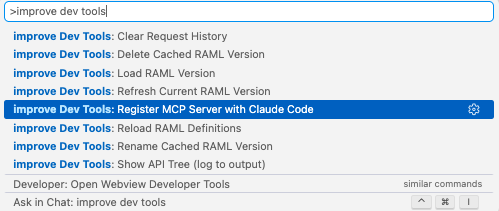
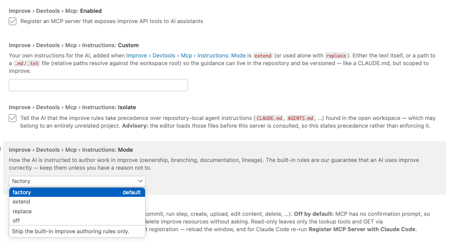
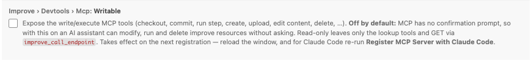

# The improve MCP Server — Manual

The improve extensions ship an **MCP server**: a bridge that lets an AI assistant
work inside improve directly. Instead of you copying paths and results back and
forth, the assistant reads resources, configures and runs steps, inspects outputs
and traces provenance — through improve's own API, under your session and your
permissions.

This manual covers what it does, how to switch it on, and how to configure it.

- [What the AI can do](#what-the-ai-can-do)
- [Setup](#setup)
- [Settings](#settings)
- [Write mode](#write-mode)
- [Instructions: teaching the AI how improve works](#instructions-teaching-the-ai-how-improve-works)
- [The RAML files — why they matter](#the-raml-files--why-they-matter)
- [Troubleshooting](#troubleshooting)

---

## What the AI can do

The server exposes two kinds of tools, and the difference matters.

**Semantic improve tools** speak in improve's own concepts — paths, steps, tools,
inputs, runs, provenance. They encode the rules of the repository, so the assistant
cannot easily do the wrong thing:

| Area | Tools |
|---|---|
| Read | `read_resource`, `list_children`, `search_resources`, `get_revisions`, `get_metadata` |
| Authoring | `checkout`, `write_content`, `edit_content`, `commit`, `revert` |
| Structure | `create_folder`, `create_tree`, `create_step`, `upload_file`, `delete_resource` |
| Steps | `describe_step`, `set_step_tool`, `set_step_input`, `clear_step_input`, `set_documentation` |
| Runs | `run_step`, `run_step_and_wait`, `get_run_output`, `list_step_outputs` |
| Provenance | `get_dependencies`, `get_usages`, `get_copy_ancestry`, `get_copy_descendants`, `get_step_tree` |

**Generic REST tools** are the escape hatch for everything the semantic layer does
not cover: `list_endpoints`, `search_endpoints`, `describe_endpoint`,
`describe_type` and `call_endpoint`. These are powered by the RAML — see
[The RAML files](#the-raml-files--why-they-matter).

Always prefer the semantic tools. They are the ones that keep your work
traceable.

---

## Setup

### Copilot and the VS Code chat

Nothing to do. When the extension activates it registers the server with VS Code's
MCP API, and the built-in chat picks it up. The AI uses your existing improve
session — no second login.

### Claude Code

Claude Code is a separate process and cannot be configured by an extension. Run the
command **improve Dev Tools: Register MCP Server with Claude Code** once from the
command palette:

It prepares the server at a stable location, then offers you the `claude mcp add`
command — either to **Run in Terminal** or to **Copy Command**. You only need to do
this once: the path stays valid across extension updates.

> Re-run this command after changing **Writable** or any **Instructions** setting —
> those are passed to the server at registration time.

---

## Settings

All settings live under **Improve › Devtools › Mcp**.

| Setting | Default | What it does |
|---|---|---|
| **Enabled** | on | Register the MCP server at all. Turn off to remove the improve tools from the AI entirely. |
| **Writable** | **off** | Expose the write/execute tools. See [Write mode](#write-mode). |
| **Instructions: Mode** | `factory` | How the AI is instructed to author work in improve. |
| **Instructions: Custom** | empty | Your own guidance — text, or a path to a `.md`/`.txt` file. |
| **Instructions: Isolate** | on | Tell the AI that the improve rules outrank a stray `CLAUDE.md`/`AGENTS.md` in the workspace. |

---

## Write mode

**Off by default, and deliberately so.** MCP has no confirmation prompt: with write
mode on, an AI assistant can modify, run and delete improve resources **without
asking you first**.

With write mode **off**, the assistant still has the full lookup surface — it can
read resources, describe steps, trace provenance, and issue `GET` requests through
`improve_call_endpoint`. It simply cannot change anything. That is a perfectly
useful mode for exploring a repository.

Turn it **on** when you want the assistant to actually do the work: create steps,
edit control files, run them, read the results.

Two things to know:

- **It takes effect on the next registration.** Reload the window, and for Claude
  Code re-run **Register MCP Server with Claude Code**.
- **Deleting still needs an explicit confirmation** from the assistant — a delete
  is irreversible, and that guard is enforced regardless of this setting.

---

## Instructions: teaching the AI how improve works

improve is not a file store. It records *why* work was done and *how* every result
was produced. An assistant that treats it like a folder tree will produce work that
runs — and is worthless the moment someone asks how a result came about.

So the server hands the AI a set of **authoring rules** before its first action:
structure work as an analysis tree; branch instead of overwriting someone else's
step; record every decision as a child step; document *why* a step exists; link data
but copy a model you intend to edit; rerun to fix, branch to progress.

These are the **built-in rules** — our guarantee, as the makers of improve, that an
AI uses it correctly.

### Mode

| Mode | Effect |
|---|---|
| **factory** *(default)* | The built-in rules only. |
| **extend** | The built-in rules **plus** your own instructions. Yours *add* to them and never override them — where they conflict, the built-in rules win. |
| **replace** | Your instructions **instead of** the built-in rules. The AI loses the improve authoring doctrine. Only use this if you know exactly why. |
| **off** | No instructions at all. |

### Custom

Your own guidance for the AI — project conventions, house rules, anything the
built-in doctrine cannot know. Two ways to supply it:

- **Inline text**, typed straight into the setting.
- **A path to a `.md` or `.txt` file.** Relative paths resolve against the workspace
  root, so the guidance can live in the repository and be versioned with it — like a
  `CLAUDE.md`, but scoped to improve.

The file variant is usually the better one: a team shares one file, reviews changes
to it, and the assistant behaves the same for everyone.

### Isolate

Your editor may have an entirely unrelated project open — one that happens to
contain a `CLAUDE.md` or `AGENTS.md` written for a completely different purpose. Left
alone, that file can pull the assistant away from how improve is meant to be used.

**Isolate** tells the AI, in plain words, that the improve rules take precedence for
every improve tool call.

> **This is advisory, not enforcement.** The editor loads those files into the
> assistant's context before this server is ever consulted, and no MCP server can
> prevent that. Isolate *states* precedence; it cannot impose it. In practice models
> honour it — but if you need a hard guarantee, do not keep unrelated agent
> instruction files in the workspace you use for improve work.

---

## The RAML files — why they matter

The generic REST tools (`list_endpoints`, `search_endpoints`, `describe_endpoint`,
`describe_type`, `call_endpoint`) are what let the AI reach parts of improve that the
semantic tools do not cover. They are only as good as the **RAML API definitions**
behind them.

The RAML is the API's specification. The extension parses it and turns it into
something the assistant can navigate: it can *search* for an endpoint by concept,
*read* its signature — parameters, request body, response type — and only then call
it, with the right shape, first time.

**Without a working RAML source, the generic layer is close to useless.** The
assistant cannot discover which endpoints exist, cannot learn what an endpoint
expects, and is reduced to guessing URLs and payloads against a live server. Guessing
against a write-enabled API is exactly what you do not want.

So: **keep the RAML configured and current.** It is not decoration — it is what turns
"call some REST endpoint" into "call the right endpoint correctly".

### Configuring the RAML source

Under **Improve › Devtools**:

| Setting | Meaning |
|---|---|
| **Raml Source** | `local` (a directory on disk) or `bitbucket` (fetched from the repository). |
| **Raml Local Path** | The directory holding `api.raml` and its includes, when the source is `local`. |
| **Bitbucket ›** … | Workspace, repo slug, base path and credentials, when the source is `bitbucket`. |

### Managing the RAML cache

The parsed API tree is cached, so the assistant does not re-read hundreds of files on
every question. Several commands in the palette manage that cache (see the screenshot
in [Setup](#setup)):

| Command | Use it when |
|---|---|
| **Load RAML Version** | Pull a specific API version into the cache. |
| **Refresh Current RAML Version** | The API changed and you want the current version re-fetched. |
| **Reload RAML Definitions** | Clear the in-memory parse and read the source again — after editing the RAML locally. |
| **Show API Tree** | Inspect what the extension actually parsed (written to the output channel). |
| **Rename / Delete Cached RAML Version** | Housekeeping on the cache. |

If the AI claims an endpoint does not exist, or gets a signature wrong, **suspect the
RAML cache first**: reload it and ask again.

> **A caveat worth knowing.** The RAML is documentation, and documentation can drift
> from the server. We found several places where it does — a query parameter that is
> documented but ignored, a description that names the wrong concept. The AI trusts
> the RAML, so where the RAML is wrong, the AI will be too. When something behaves
> unexpectedly, the running server is the authority, not the spec.

---

## Troubleshooting

**The AI only has read tools.** Write mode is off — that is the default. See
[Write mode](#write-mode). Remember to re-register afterwards.

**Nothing changed after I flipped a setting.** Settings reach the server when it is
*registered*, not while it runs. Reload the window; for Claude Code, re-run
**Register MCP Server with Claude Code**.

**Claude Code connects, but to the wrong server.** Claude Code can hold several
registrations for the same name in different scopes (local, project, user), and the
most specific one wins. Run `claude mcp list` — it reports conflicting scopes
explicitly. Remove the ones you do not want, or make sure the one that wins is the
one you configured.

**The AI cannot find an endpoint that exists.** The RAML cache is stale or the source
is misconfigured. See [Managing the RAML cache](#managing-the-raml-cache).

**A step ran, reported success, and produced nothing.** A terminal run status means
the *run server* finished — not that the tool succeeded. Read the step's outputs
(`STDOUT`, the result files) to confirm. Ask the assistant to check the actual result
file, not just the status.
